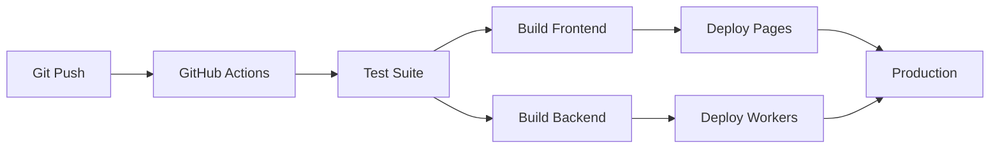

# Architecture Overview

## System Architecture

Hay School is built as a modern web application with a clear separation between frontend and backend, optimized for deployment on Cloudflare's edge network.

```
┌─────────────────┐    ┌─────────────────┐    ┌─────────────────┐
│   React App     │    │  Cloudflare     │    │   Hono API      │
│   (Frontend)    │◄──►│   Pages         │◄──►│   (Backend)     │
│                 │    │                 │    │                 │
│ - TypeScript    │    │ - CDN           │    │ - TypeScript    │
│ - React Router  │    │ - Auto-scaling  │    │ - REST API      │
│ - Tailwind CSS  │    │ - SSL/TLS       │    │ - Validation     │
│ - PWA Ready     │    │ - Analytics     │    │ - CORS          │
└─────────────────┘    └─────────────────┘    └─────────────────┘
                              ▲                        ▲
                              │                        │
                       ┌──────┴──────┐        ┌────────┴────────┐
                       │ Cloudflare  │        │   Databases    │
                       │ Workers KV  │        │                │
                       │ (Caching)   │        │ - D1 (SQL)     │
                       └─────────────┘        │ - KV (Key-val) │
                                              │ - R2 (Storage) │
                                              └───────────────┘
```

## Core Components

### Frontend Architecture

#### Technology Stack
- **React 19**: Modern React with concurrent features
- **TypeScript**: Type-safe development
- **React Router**: Client-side routing with hash routing
- **TanStack Query**: Server state management and caching
- **Tailwind CSS**: Utility-first CSS framework
- **Vite**: Fast build tool and dev server

#### Component Structure
```
src/
├── components/           # Reusable UI components
│   ├── Layout/          # App shell and navigation
│   └── ui/              # Base UI components
├── pages/               # Route-based page components
│   ├── Home/            # Landing page
│   ├── Categories/      # Subject selection
│   ├── Subject/         # Subject-specific content
│   ├── Profile/         # User profile management
│   └── About/           # Information pages
├── hooks/               # Custom React hooks
├── types/               # TypeScript definitions
├── utils/               # Helper functions
└── lib/                 # Library configurations
```

#### State Management
- **Local State**: React useState/useReducer for component state
- **Server State**: TanStack Query for API data fetching and caching
- **Form State**: React Hook Form for complex forms
- **Global State**: Context API for theme, user preferences

### Backend Architecture

#### Technology Stack
- **Hono**: Lightweight web framework for Cloudflare Workers
- **TypeScript**: Type-safe API development
- **Zod**: Runtime type validation
- **Cloudflare Workers**: Serverless functions at the edge

#### API Structure
```
src/
├── routes/              # API route handlers
│   ├── subjects.ts      # Subject management
│   ├── users.ts         # User profiles and progress
│   ├── progress.ts      # Learning progress tracking
│   └── contact.ts       # Contact form handling
├── index.ts             # Main application setup
└── test/                # API tests
```

#### Data Flow
```
Client Request → Hono Route → Validation → Business Logic → Response
                      ↓
                Database/Storage
                      ↓
                Cache Layer (KV)
```

## Data Architecture

### Data Models

#### User Profile
```typescript
interface User {
  id: string;
  name: string;
  age: number;
  grade: number;
  favoriteSubject: string;
  learningStyle: 'visual' | 'auditory' | 'kinesthetic';
  progress: UserProgress;
  createdAt: string;
  updatedAt: string;
}
```

#### Subject Content
```typescript
interface Subject {
  id: string;
  name: string;
  description: string;
  icon: string;
  color: string;
  totalLessons: number;
  modules: Module[];
}
```

#### Learning Progress
```typescript
interface ProgressRecord {
  id: string;
  userId: string;
  subjectId: string;
  lessonId: number;
  completed: boolean;
  score?: number;
  timeSpent: number;
  completedAt?: string;
}
```

### Database Strategy

#### Development (In-Memory)
- Simple JavaScript Maps for quick development
- No persistence (resets on restart)
- Easy to modify and test

#### Production Options
- **Cloudflare D1**: SQLite-compatible SQL database
- **Cloudflare KV**: Key-value store for caching
- **Cloudflare R2**: Object storage for media files

### Caching Strategy

#### Frontend Caching
- **TanStack Query**: Automatic caching with stale-while-revalidate
- **Service Worker**: Offline content caching
- **Local Storage**: User preferences and offline data

#### Backend Caching
- **Cloudflare KV**: API response caching
- **CDN Caching**: Static asset caching at edge

## Security Architecture

### Frontend Security
- **Content Security Policy**: Restrict resource loading
- **XSS Prevention**: Sanitize user inputs
- **HTTPS Only**: Secure communication
- **Input Validation**: Client-side validation with server confirmation

### Backend Security
- **Input Validation**: Zod schemas for all inputs
- **Rate Limiting**: Prevent abuse (configurable)
- **CORS**: Configured origins for cross-origin requests
- **Error Handling**: Safe error responses without data leakage

### Data Privacy
- **Minimal Data Collection**: Only essential user data
- **No Third-Party Tracking**: No external analytics or ads
- **Local Storage**: User preferences stored locally
- **GDPR Compliance**: Data export/deletion capabilities

## Performance Architecture

### Frontend Performance
- **Code Splitting**: Route-based and component-based splitting
- **Lazy Loading**: Components loaded on demand
- **Image Optimization**: Responsive images with modern formats
- **Bundle Optimization**: Tree shaking and minification

### Backend Performance
- **Edge Computing**: Code runs close to users
- **Caching**: Multi-layer caching strategy
- **Compression**: Automatic response compression
- **Connection Pooling**: Efficient database connections

### Network Performance
- **CDN**: Global content delivery
- **HTTP/2**: Multiplexed connections
- **Resource Hints**: Preload critical resources
- **Service Worker**: Background caching and sync

## Deployment Architecture

### CI/CD Pipeline


### Environment Strategy
- **Development**: Local development with hot reload
- **Staging**: Automated deployments from feature branches
- **Production**: Main branch deployments with approval gates

### Monitoring & Observability
- **Cloudflare Analytics**: Real user monitoring
- **Error Tracking**: Client and server error logging
- **Performance Monitoring**: Core Web Vitals tracking
- **Uptime Monitoring**: Health check endpoints

## Scalability Considerations

### Horizontal Scaling
- **Cloudflare Workers**: Automatic scaling to zero or millions
- **CDN**: Global distribution of static assets
- **Edge Computing**: Code execution near users

### Vertical Scaling
- **Database Optimization**: Indexing and query optimization
- **Caching Layers**: Multiple levels of caching
- **Asset Optimization**: Compressed and optimized resources

### Future Scaling
- **Microservices**: API decomposition as needed
- **Multi-region**: Global deployment expansion
- **Advanced Caching**: More sophisticated caching strategies

## Offline Architecture

### Service Worker Strategy
```
├── Install Event
│   ├── Cache App Shell
│   ├── Cache Critical Assets
│   └── Cache Subject Metadata
├── Fetch Event
│   ├── Network First (API calls)
│   ├── Cache First (Static assets)
│   └── Stale While Revalidate (Content)
└── Background Sync
    ├── Queue Offline Actions
    ├── Sync When Online
    └── Handle Conflicts
```

### Offline Content Strategy
- **App Shell**: Core UI always available
- **Critical Subjects**: Basic math and reading offline
- **Progressive Enhancement**: Enhanced features when online
- **Background Sync**: Upload progress when connection restored

## Testing Architecture

### Testing Pyramid
```
End-to-End Tests (E2E)
    ↕️
Integration Tests (API)
    ↕️
Unit Tests (Components/Functions)
```

### Test Categories
- **Unit Tests**: Component and utility function testing
- **Integration Tests**: API endpoint testing
- **E2E Tests**: User journey testing
- **Performance Tests**: Load and performance testing
- **Accessibility Tests**: WCAG compliance testing

### Test Infrastructure
- **Vitest**: Fast unit testing framework
- **Testing Library**: React component testing utilities
- **Playwright**: E2E testing framework
- **Lighthouse**: Performance and accessibility auditing

## Monitoring & Analytics

### Application Metrics
- **User Engagement**: Page views, session duration, bounce rate
- **Learning Progress**: Completion rates, time spent, scores
- **Technical Performance**: Load times, error rates, API latency
- **Business Metrics**: User acquisition, retention, feature usage

### Infrastructure Monitoring
- **Cloudflare Analytics**: Edge performance and security
- **Worker Metrics**: Function execution time and errors
- **Database Metrics**: Query performance and usage
- **CDN Metrics**: Cache hit rates and bandwidth

## Disaster Recovery

### Backup Strategy
- **Code**: Git version control with multiple remotes
- **Database**: Automated backups with point-in-time recovery
- **Assets**: Multi-region replication in Cloudflare R2
- **Configuration**: Infrastructure as code with version control

### Recovery Procedures
1. **Code Rollback**: Git revert to previous working version
2. **Database Restore**: Automated restore from backups
3. **DNS Failover**: Traffic routing to backup regions
4. **Communication**: User notification and status updates

### Business Continuity
- **Multi-region Deployment**: Automatic failover capabilities
- **Graceful Degradation**: Core features work during partial outages
- **Offline Mode**: Application functions without backend
- **Progressive Enhancement**: Enhanced features when systems recover

## Future Architecture Evolution

### Phase 2: Enhanced Features
- **Real-time Collaboration**: WebSocket support for group learning
- **AI-Powered Learning**: Personalized learning paths
- **Advanced Analytics**: Detailed learning pattern analysis
- **Multi-language Support**: Additional Malagasy language support

### Phase 3: Enterprise Features
- **School Management**: Multi-user classrooms and assignments
- **Parent Portal**: Progress monitoring and communication
- **Teacher Tools**: Content creation and student management
- **Assessment Engine**: Advanced quiz and test capabilities

### Technical Debt Management
- **Regular Refactoring**: Code quality maintenance
- **Dependency Updates**: Security and performance updates
- **Performance Optimization**: Continuous improvement
- **Testing Coverage**: Expanding test coverage over time

This architecture provides a solid foundation for Hay School while remaining flexible for future growth and feature additions.
